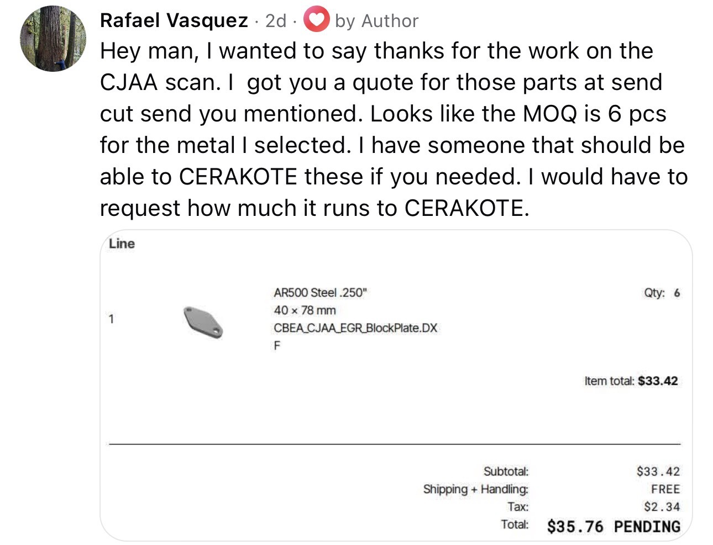

# 1983 Toyota Pickup 4WD (RN38) Build Log

Comprehensive documentation of the full restoration and modification of my 1983 Toyota Pickup 4WD.  

-   Project Overview

    -   Vehicle: 1983 Toyota Pickup 4WD
    -   Major Project: CBEA 2.0 TDI Engine Swap from 8P Audi
    -   Goals: Reliable daily driver with solid off-road capability and better power/economy

-   Key Components

    -   Engine: CBEA 2.0 TDI (Tunezilla Stage 2.5)
    -   Transmission: R151F
    -   Other Upgrades: TD Conversions mounts/adapter, BMW CP3 + Fischer kit, Fast Forward wiring,  
        Volvo EPS (or ALH PS pump), etc.

# TDI Swap

https://github.com/user-attachments/assets/cdc6303a-8330-4c33-8ca4-62f4251baac9

-   CBEA/CJAA

    -   EGR
    
        CAD files for block-off plates on the exhaust manifold [here](./CAD/parts/tdi/block_off_plates/) (not yet tested).  
        Quote as of 2026-07-07 (thanks Rafael!):  
          
    
    -   Turbo
    
        Turbo flipped to route exhaust toward the rear. Process and notes [here](./docs/common_rail/turbo/).  
    
    -   Oil Pan
    
        Comparison between factory cast aluminum and hybrid (aluminum upper + steel lower) pans.  The  
        hybrid is the plan — similar height to stock but the steel bottom is far more forgiving on  
        rocks and the front diff.  Images and notes [here](./docs/common_rail/oil_pan/).  
    
    -   Electrical
    
        -   Interface Hardware
        
            -   [Widget Man BTAC2](https://drive.google.com/file/d/1sY_qYCQMJ6KPikZYNQ9rVLyK7spUNtxH/view) — converts ECU tach signal from 5V square wave to coil 'spike' signal.
            -   [CAN2DASH](https://docs.google.com/document/d/14yhZbFgCjSgXWqCNNCHgp3wLcAsCKACMEeC2nDtL2TU/edit?tab=t.0) or custom Raspberry Pi setup?
            -   Others?
        
        -   Radiator / Cooling
        
            -   Fan Control
            
                -   [Fast Forward Fan Controller](https://docs.google.com/document/d/1CelB9Cl67-BNgkVXCFP4iwNl0KzHiYtnKfgr1wkl-Oo/edit?tab=t.0) or [Widget Man FDM2](https://drive.google.com/file/d/1sY_qYCQMJ6KPikZYNQ9rVLyK7spUNtxH/view)
                -   Others?

# Brakes

-   86 Toyota Pickup 4WD V6 hubs
-   1st Gen Tacoma rotors
-   1st Gen Tacoma calipers

# Third Party Content

The SSP PDF is copyrighted material from Volkswagen and included here for reference only.  

