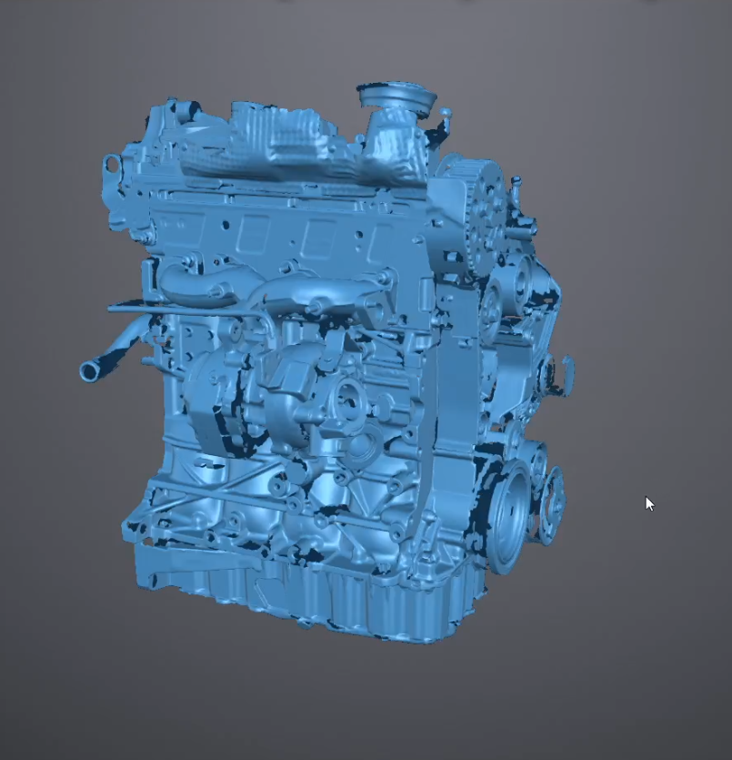

* CJAA 3D Scan

I scanned a CJAA engine for reference. What started as a quick scan of a small bolt pattern turned
into a full engine scan. The model is in rough shape with some missing details, but all the
important geometry is there. Feel free to use it for whatever creative projects or modifications you
have in mind.

