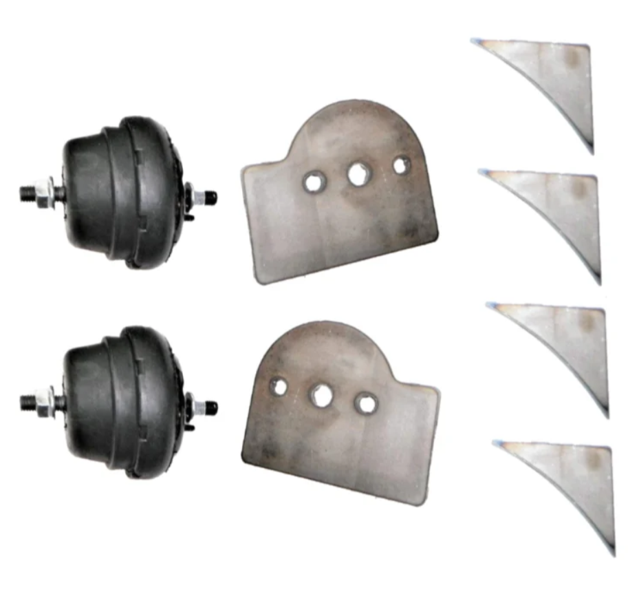
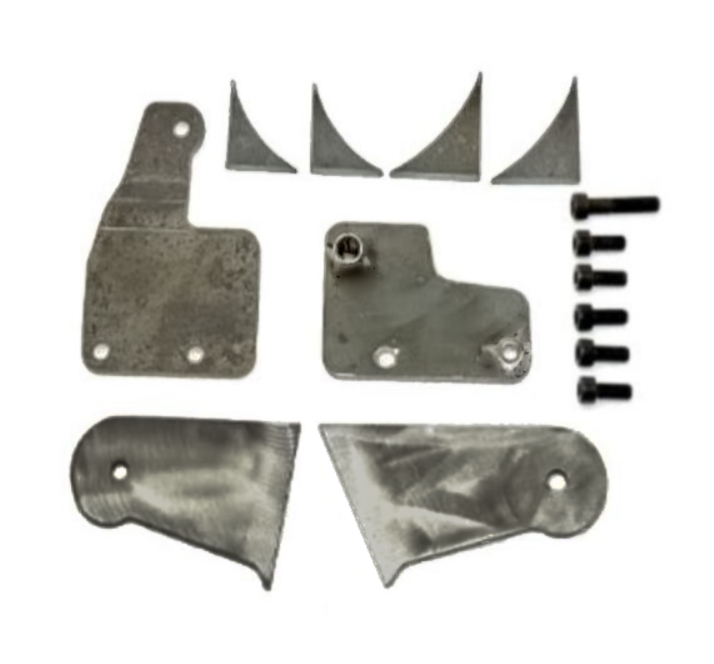
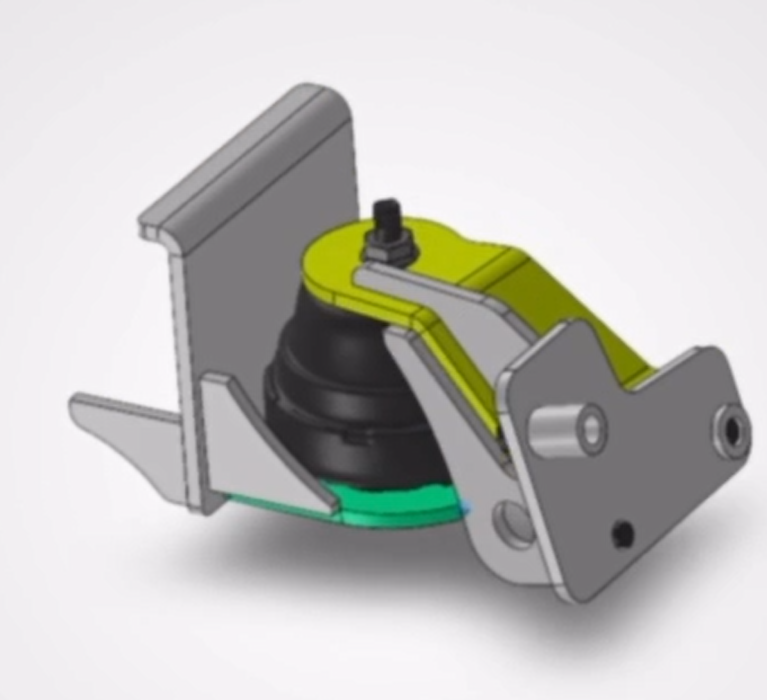
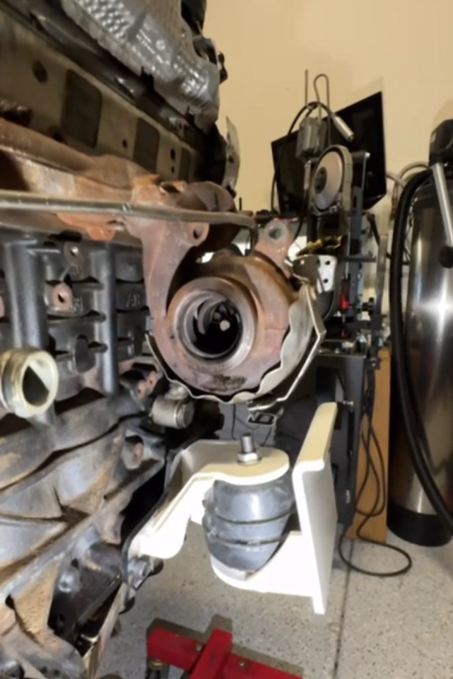
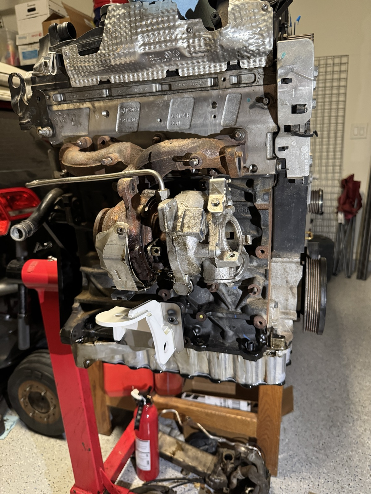

#+OPTIONS: toc:nil num:nil H:1 date:nil creator:nil timestamp:nil \n:t author:nil

* Engine Mounts
  Mounts are in WIP.

  Mounts were 3D printed and hot glued together for mock up purposes. Mounts started life as a
  universal kit that I've modified for my chassis (both engine and chassis side mounts).

  Mounts will be fab'ed up and welded as soon as I confirm fitment in engine bay.

** Universal kit
   #+ATTR_HTML: :width 1060
   
   

** CAD
   #+ATTR_HTML: :width 1060
   

** 3D Printed
   #+ATTR_HTML: :width 1060
   
   
