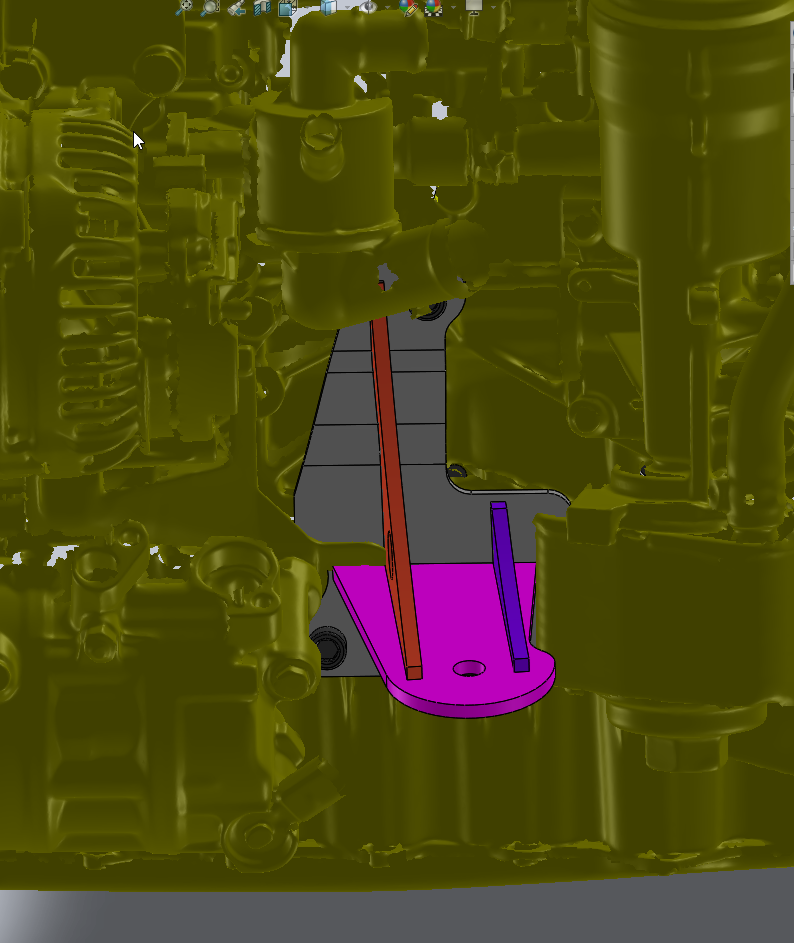
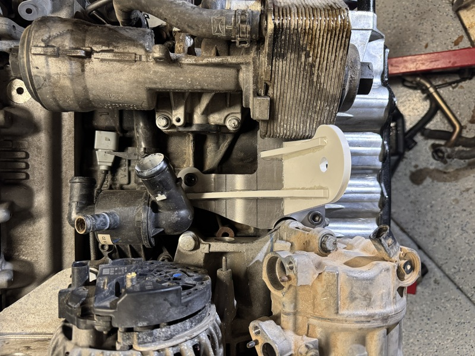
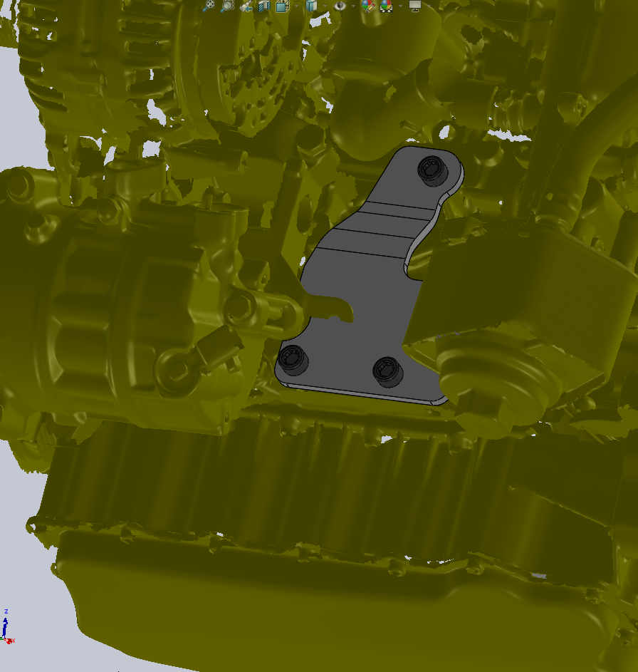
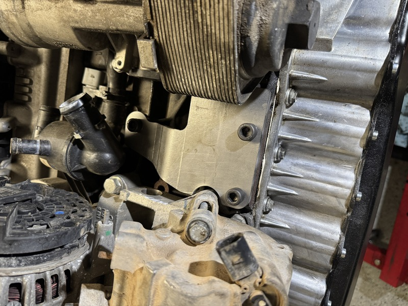
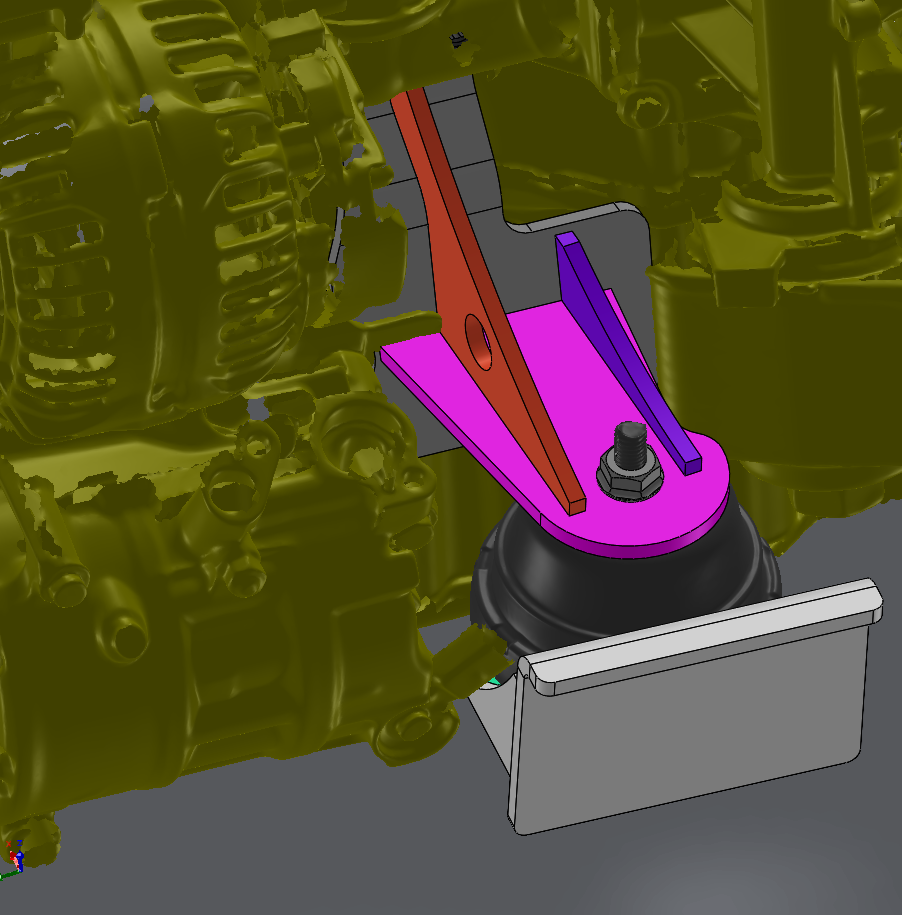
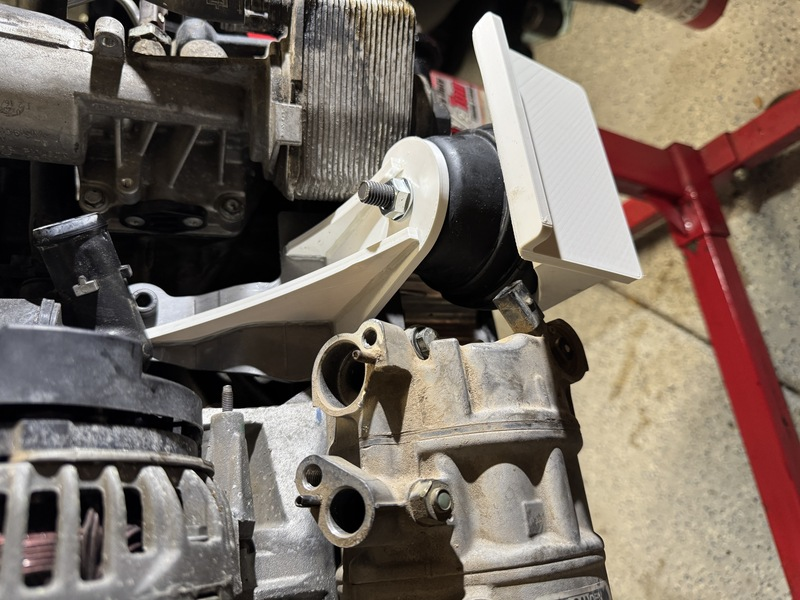
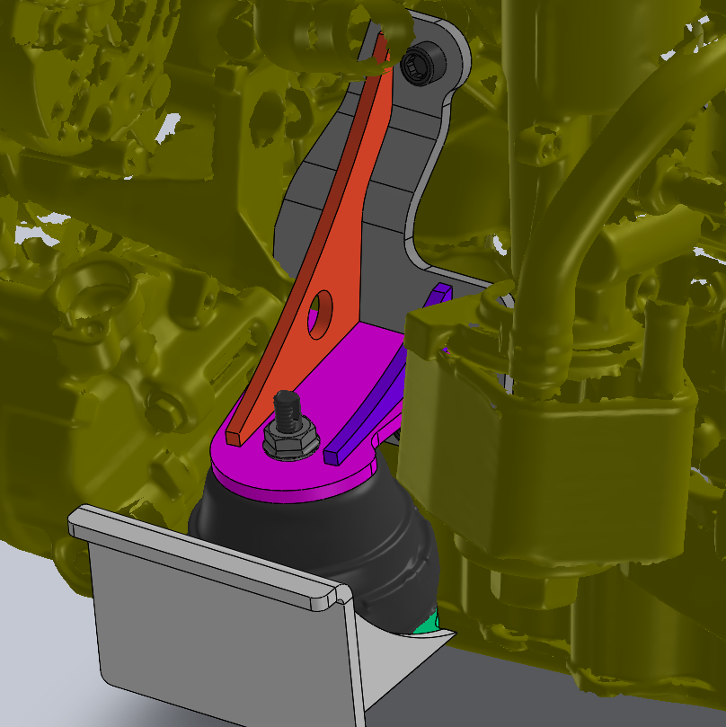
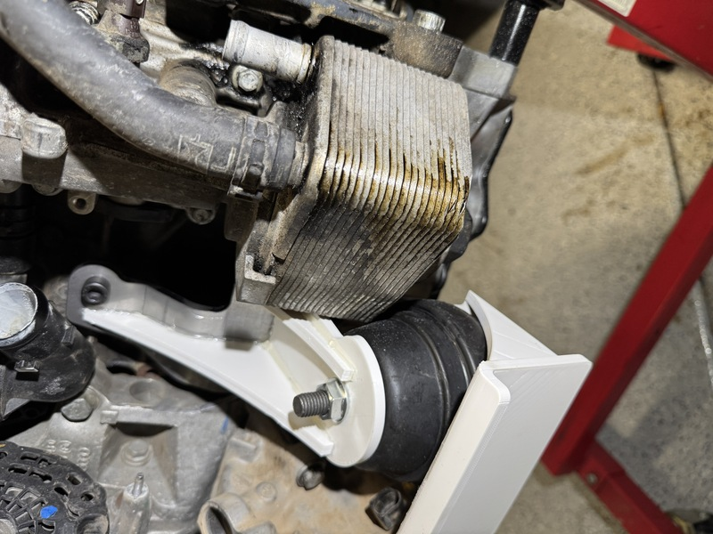

#+OPTIONS: toc:nil num:nil H:1 date:nil creator:nil timestamp:nil \n:t author:nil

* Engine Mounts
  Mounts are ready for engine bay mockup.

  Mounts were 3D printed and hot glued together for mock up purposes. Mounts started life as a
  universal kit that I've modified for my chassis (both engine and chassis side mounts).

  Mounts will be fab'ed up and welded as soon!

** Universal kit
   #+ATTR_HTML: :width 800
   [[./universal_mounts_chassis_side.png]]
   [[./universal_mounts_engine_side.png]]

** CAD
   #+ATTR_HTML: :width 800
   [[./screenshot_enginemount.png]]

** 3D Printed
   #+ATTR_HTML: :width 800
   [[./screenshot_enginemount_printed.png]]
   [[./mount_engine_side_printed.jpg]]

** Side By Side
   |-----------------------------+-----------------------------|
   | CAD                         | Physical                    |
   |-----------------------------+-----------------------------|
   |  |  |
   |  |  |
   |  |  |
   |  |  |
   |-----------------------------+-----------------------------|
