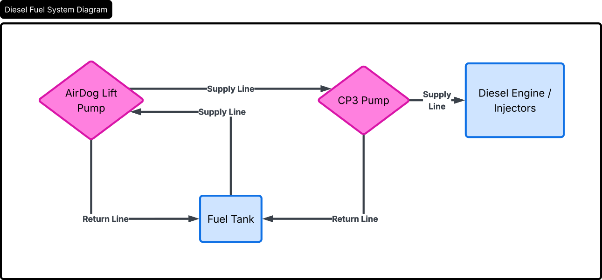
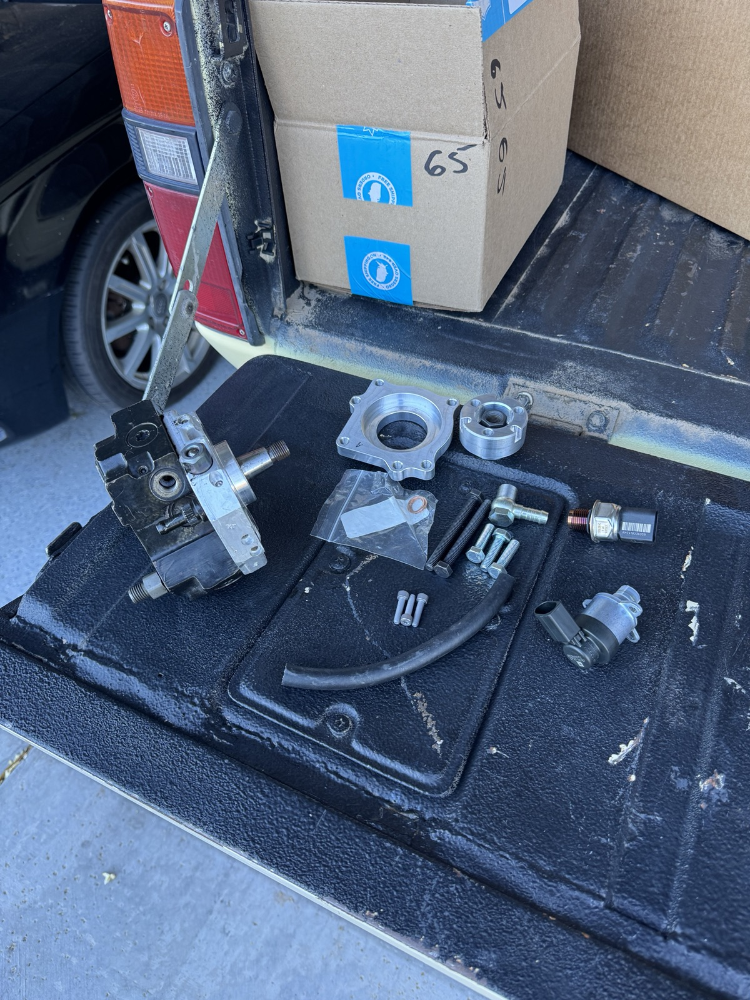

* Fuel System Diagram
  I'm considering eliminating the factory common rail fuel filter and go with an AirDog fuel
  pump. Not sure yet but I'm laying down my thoughts now and I'll return to it later. Diagram may or
  may not be correct.

  #+ATTR_HTML: :width 1060
  

* CP4 -> CP3 Conversion
  The factory CBEA/CJAA high-pressure fuel pump is a Bosch CP4. While it can produce higher peak
  rail pressures than the older CP3, it is more sensitive to fuel lubricity and contamination. When
  a CP4 fails, it often sends metal debris through the entire fuel system (rail, injectors, lines,
  and tank).

  The CP3 uses a more robust cam and follower design that is far less prone to this catastrophic
  failure mode. Converting to a CP3 (Fischer kit + BMW pump) significantly reduces the risk of a
  pump failure destroying the rest of the fuel system.

  #+ATTR_HTML: :width 1060
  
