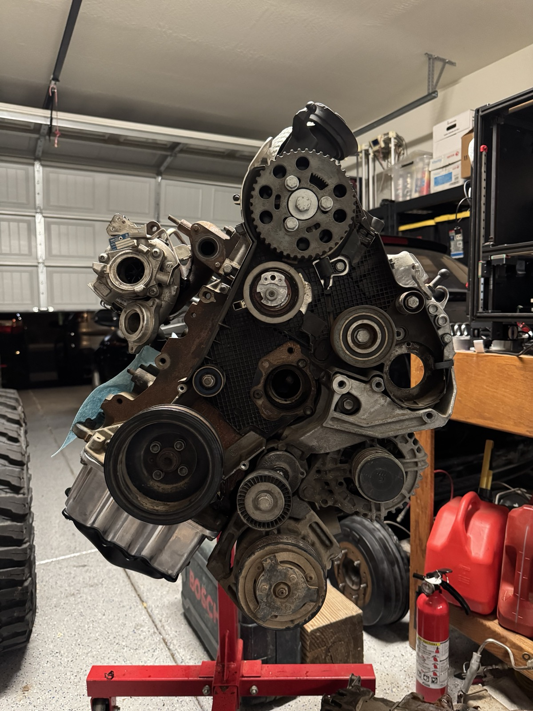
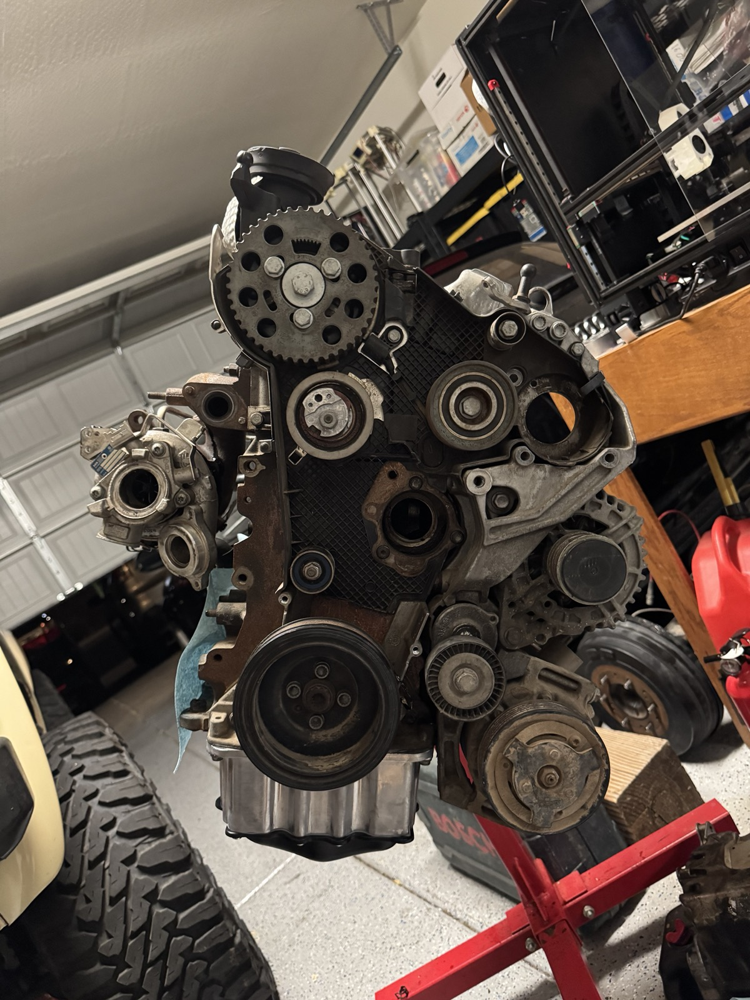
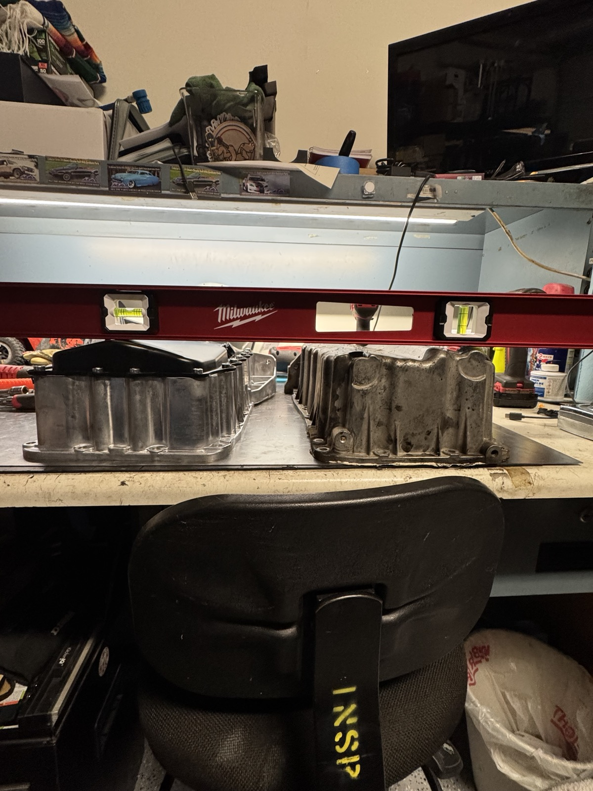
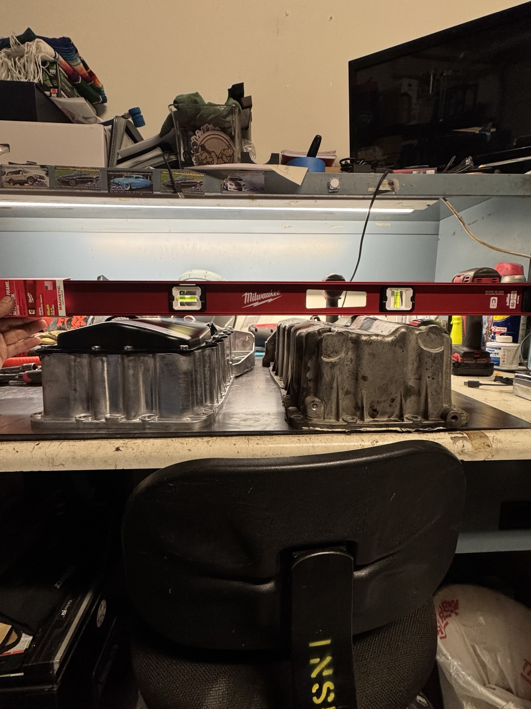
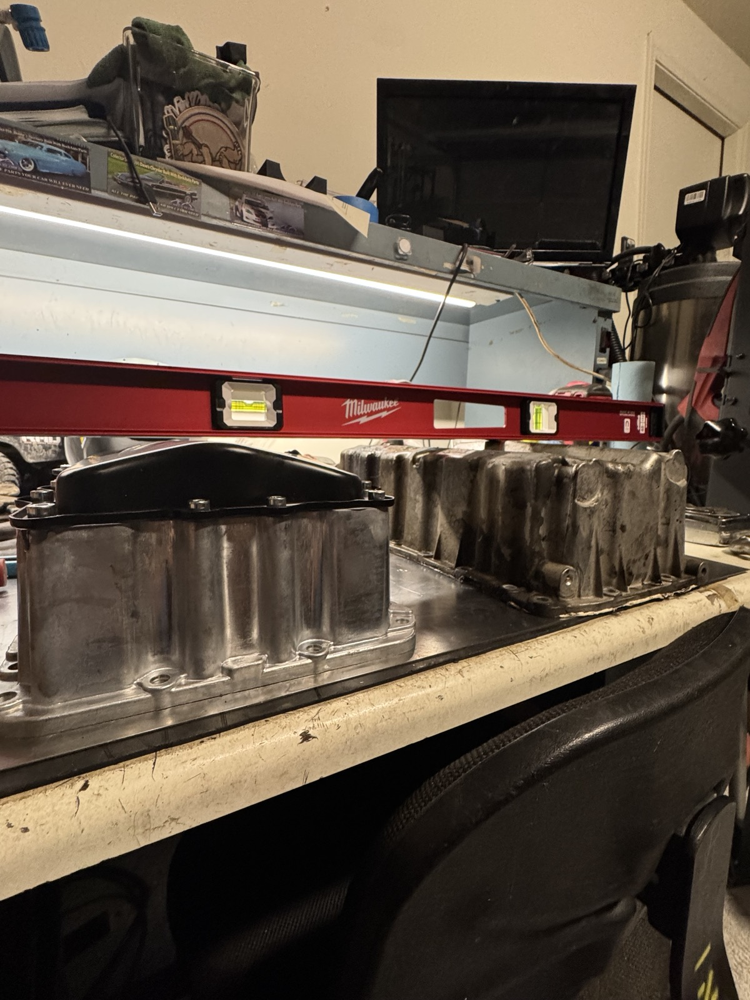
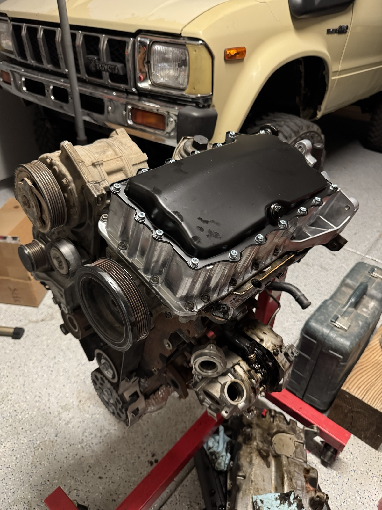
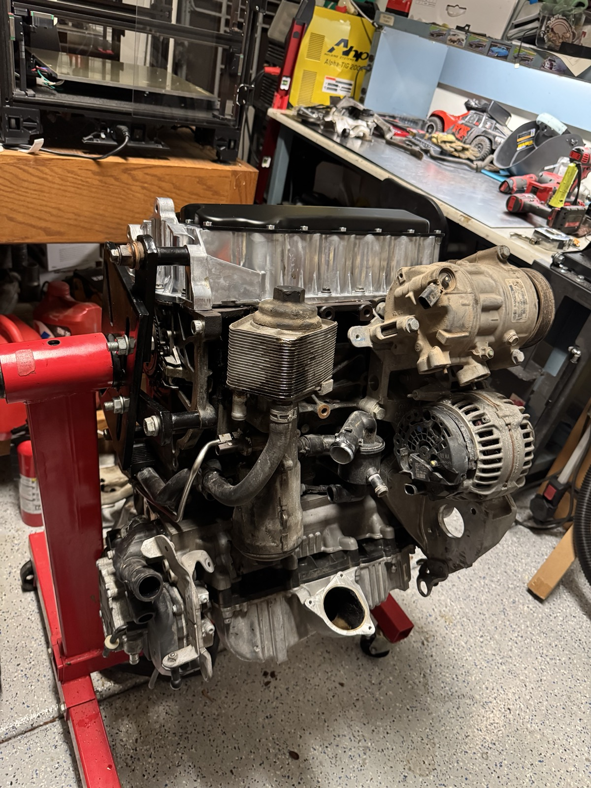

#+OPTIONS: toc:nil num:nil H:1 date:nil creator:nil timestamp:nil \n:t author:nil

* Hybrid Oil Pan vs Factory Cast Aluminum Oil Pan

** Factory CBEA Oil Pan (cast aluminum)
   - Deeper sump design
   - More prone to cracking on impact
   - Standard height (limited clearance over front differential)

** Hybrid Oil Pan (aluminum upper + stamped steel lower)
   - Shallower overall profile → better clearance for 4WD and lowered applications
   - Steel bottom is far more forgiving — it bends instead of shattering like cast aluminum
   - Height is similar to the factory CBEA pan in many areas, but the steel construction makes it
     significantly more durable when hitting obstacles

* Recommendation:
  The hybrid pan is the preferred option for this swap. While the height difference is modest, the
  steel bottom provides much better protection against rocks, the front diff, and other
  undercarriage hazards common in a 4WD truck.

* Comparison Images
  #+ATTR_HTML: :width 500
  
  
  
  
  
  
  
