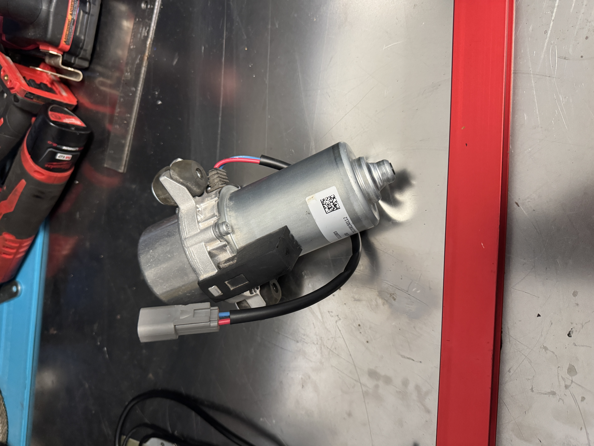

#+OPTIONS: toc:nil num:nil H:1 date:nil creator:nil timestamp:nil \n:t author:nil

* Vacuum Pump |WIP|
  Eliminate the mechanical pump? Only reason to eliminate it is because it interferes with the
  firewall. I am looking at the Hella UP28/30 pump used on many modern vehicles. It will need a
  reservoir tank to store vacuum and a vacuum switch to avoid running the pump continuously.

  #+ATTR_HTML: :width 530
  
